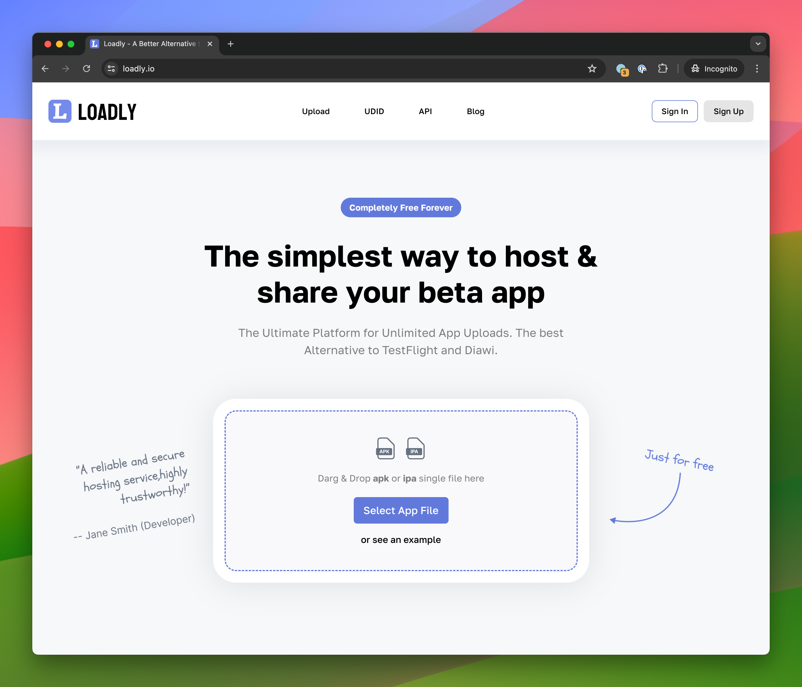

# Loadly

Loadly is a powerful app distribution platform designed for developers, offering a seamless alternative to TestFlight and Diawi. It simplifies the process of uploading and sharing iOS and Android apps with a focus on speed, security, and ease of use.

## Features

- **Unlimited App Uploads**: Share as many apps as you need without restrictions.
- **Large File Support**: Upload files up to 2GB.
- **Secure Hosting**: Enjoy fast, secure downloads through Cloudflare CDN.
- **Easy Distribution**: Share apps via links or QR codes.
- **Real-time Analytics**: Monitor installations and crash reports.
- **Team Collaboration**: Collaborate with your team effortlessly.
- **API Integration**: Integrate with your development workflow.

## Benefits

- **Free to Use**: No hidden costs or fees.
- **Dedicated Support**: Access dedicated email support for any issues.
- **High-speed Downloads**: Ensure rapid distribution of your apps.

## Get Started

Visit [Loadly](https://loadly.io) to start distributing your apps with ease.

